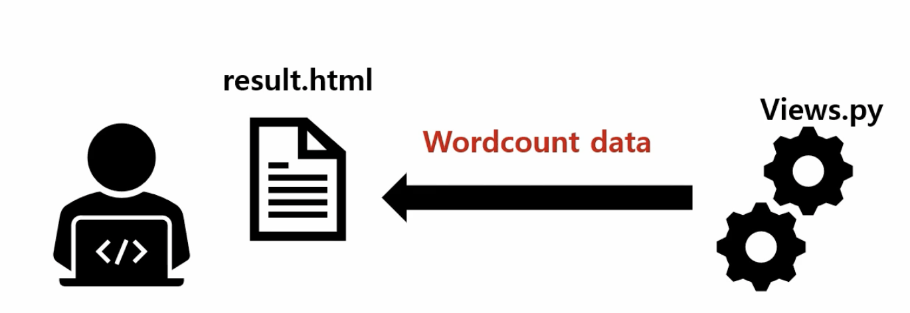
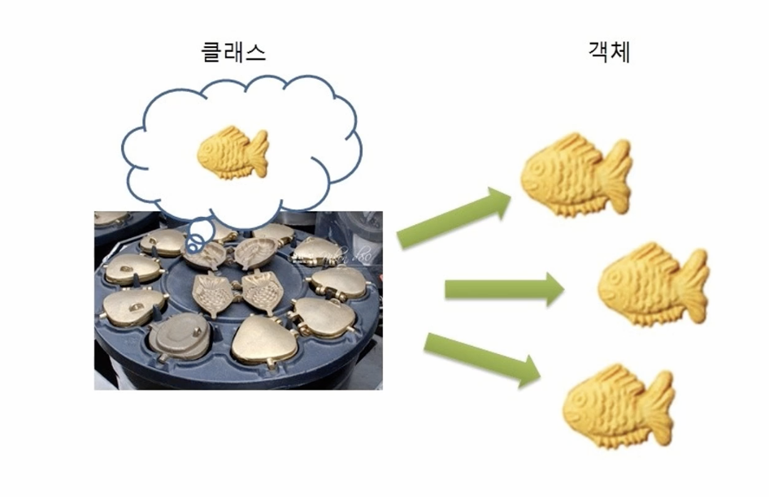

# Django와 데이터베이스 (Model 실습)

---

### 지난 시간 복습

- urls.py

```python
path('wordCount/result/', wc.result, name="result")
```

→ 첫번째 인자 : 웹사이트의 로컬 호스트 뒤쪽에 붙어있는 부분

→ 두번째 인자 : views.py에서 나오는 함수들 (요청이 오면 이 함수를 실행 시킨다는 것임)

→ 세번째 인자 : 어딘가에 접근할 수 있게끔 열어두는 namespace

- 템플릿과 views.py만을 이용한 웹서비스 플로우



---

### 실습에 들어가기전,,

## 클래스?

- 정보를 저장하는 틀 == 테이블이라고 생각해도 좋다.



---

# 실습

### flow

- 새로운 "blog"앱 만들기
- settings.py 수정 : blog앱이 만들어졌다는 것을 알려주기
- blog 앱 >> models.py 에서 class 만들어주기

    ```python
    from django.db import models

    class Blog(models.Model):
    		# 상속받은 Model안에 ID가 이미 저장이 되어있어서 ID는 따로 작성을 안해줘도 된다.
        # 필요한 필드와 필드 옵션은 그때그때 검색해서 찾는게 더 낫당 
          title = models.CharField(max_length=200)
          writer = models.CharField(max_length=100)
          pub_date = models.DateTimeField()    # 날짜와 시간을 정해주는 필드
          body = models.TextField()     # 본문 (제한없는 text 필드)
    ```

- **$ python manage.py makemigrations** : models.py의 변경사항을 감지해서 table을 만들것이라는 것을  migration 폴더에!
    - makemigrations : 앱 내의 migration 폴더를 만들어서 models.py의 변경사항에 저장
- **$ python manage.py migrate**
    - migrate : migration 폴더를 실행시켜 데이터베이스에 적용

### admin 페이지

- **$ python manage.py createsuperuser** : 슈퍼유저 생성
- blog >> admin.py

```python
from django.contrib import admin
from .models import Blog

# Register your models here.
admin.site.register(Blog)   #Blog 테이블을 어드민 사이트에 등록!
```

→ 이렇게 하면 admin 사이트에 blog 테이블이 생성이 된다.

option!

- blog >> models.py

```python
from django.db import models

# Create your models here.
class Blog(models.Model):
    # 필요한 필드와 필드 옵션은 그때그때 검색해서 찾는게 더 낫당 
    title = models.CharField(max_length=200)
    writer = models.CharField(max_length=100)
    pub_date = models.DateTimeField()    # 날짜와 시간을 정해주는 필드
    body = models.TextField()     # 본문 (제한없는 text 필드)

    **# 어디선가 객체가 호출이 되었을 때, 나오는 이름 설정
    def __str__(self):
        return self.title #글의 제목으로 설정**
```