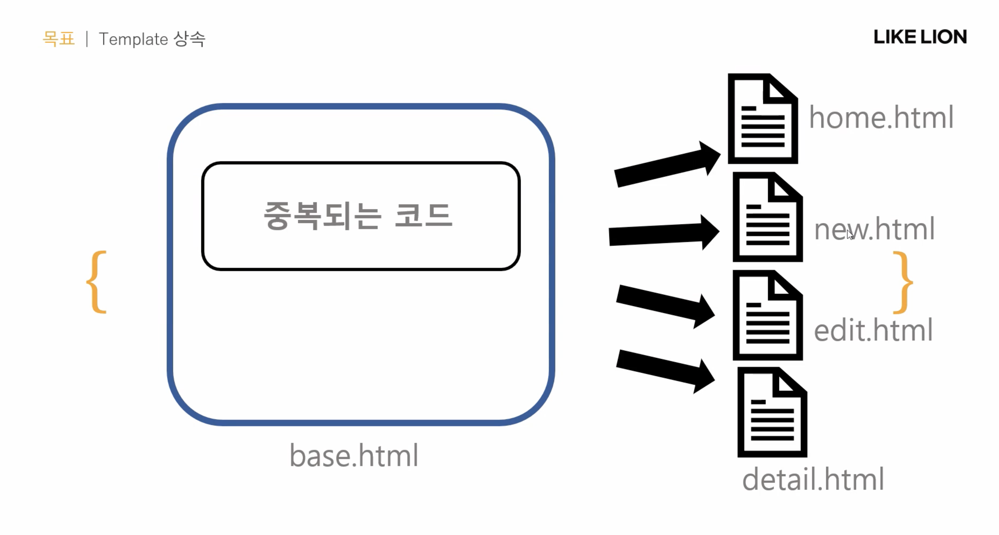

# Template 상속

---



### 실습 (1)

- 중복되는 navbar을 하나의 html로 만들어 template을 상속시키자!

1. 프로젝트와 같은 이름의 폴더 밑에 templates 폴더 > base.html 생성
2. base.html에 공통된 중복 코드를 작성
3. blog.html, new.html, edit.html, detail.html 수정

firstproject > templates > base.html

```html
<!DOCTYPE html>
<html lang="en">
<head>
    <meta charset="UTF-8">
    <meta http-equiv="X-UA-Compatible" content="IE=edge">
    <meta name="viewport" content="width=device-width, initial-scale=1.0">
    <title>BLOG</title>
    <link href="https://cdn.jsdelivr.net/npm/bootstrap@5.0.2/dist/css/bootstrap.min.css" rel="stylesheet" integrity="sha384-EVSTQN3/azprG1Anm3QDgpJLIm9Nao0Yz1ztcQTwFspd3yD65VohhpuuCOmLASjC" crossorigin="anonymous">
    <script src="https://cdn.jsdelivr.net/npm/bootstrap@5.0.2/dist/js/bootstrap.bundle.min.js" integrity="sha384-MrcW6ZMFYlzcLA8Nl+NtUVF0sA7MsXsP1UyJoMp4YLEuNSfAP+JcXn/tWtIaxVXM" crossorigin="anonymous"></script>
    <style>
        body{text-align: center;}
    </style>
</head>
<body>
    <nav class="navbar navbar-expand-lg navbar-light bg-light">
        <div class="container-fluid">
          <a class="navbar-brand" href="#">Navbar</a>
          <button class="navbar-toggler" type="button" data-bs-toggle="collapse" data-bs-target="#navbarSupportedContent" aria-controls="navbarSupportedContent" aria-expanded="false" aria-label="Toggle navigation">
            <span class="navbar-toggler-icon"></span>
          </button>
          <div class="collapse navbar-collapse" id="navbarSupportedContent">
            <ul class="navbar-nav me-auto mb-2 mb-lg-0">
              <li class="nav-item">
                <a class="nav-link active" aria-current="page" href="#">Home</a>
              </li>
              <li class="nav-item">
                <a class="nav-link" href="#">Link</a>
              </li>
              <li class="nav-item dropdown">
                <a class="nav-link dropdown-toggle" href="#" id="navbarDropdown" role="button" data-bs-toggle="dropdown" aria-expanded="false">
                  Dropdown
                </a>
                <ul class="dropdown-menu" aria-labelledby="navbarDropdown">
                  <li><a class="dropdown-item" href="#">Action</a></li>
                  <li><a class="dropdown-item" href="#">Another action</a></li>
                  <li><hr class="dropdown-divider"></li>
                  <li><a class="dropdown-item" href="#">Something else here</a></li>
                </ul>
              </li>
              <li class="nav-item">
                <a class="nav-link disabled" href="#" tabindex="-1" aria-disabled="true">Disabled</a>
              </li>
            </ul>
            <form class="d-flex">
              <input class="form-control me-2" type="search" placeholder="Search" aria-label="Search">
              <button class="btn btn-outline-success" type="submit">Search</button>
            </form>
          </div>
        </div>
      </nav>

      <div class="container">
        
        

      </div>
      
    </body>
</html>
```

blog.html

```html



    <h1>Blog Project</h1>
    <div>
        <a href="">write blog</a>
    </div>
    <div class="container">
    
    <div>
        <h3>{{blog.title}}</h3>
        {{blog.id}}
        {{blog.writer}}
        {{blog.pub_date}}
        {{blog.summary}} <a href="">...more</a>
        <br>
    </div>
    
</div>


```

firstproject > settings.py

```python
TEMPLATES = [
    {
        'BACKEND': 'django.template.backends.django.DjangoTemplates',
        'DIRS': ['firstproject/templates'],
        'APP_DIRS': True,
        'OPTIONS': {
            'context_processors': [
                'django.template.context_processors.debug',
                'django.template.context_processors.request',
                'django.contrib.auth.context_processors.auth',
                'django.contrib.messages.context_processors.messages',
            ],
        },
    },
]
```

### 실습 (2)

- urls.py를 app별로 관리하는 방법

1. blog > urls.py

```python
from django.contrib import admin
from django.urls import path
from .views import * 

urlpatterns = [
    path('<str:id>', detail, name="detail"),
    path('new/',new,name="new"),
    path('create/',create, name="create"),
    path('edit/<str:id>', edit, name="edit"),
    path('update/<str:id>', update, name="update"),
    ## delete!!
    path('delete/<str:id>', delete, name="delete"),
]
```

2. firstproject > urls.py

```python
from django.contrib import admin
from django.urls import path, include
from blog.views import blog

urlpatterns = [
    path('admin/', admin.site.urls),
    path('', blog, name="blog"),
    path('blog/', include('blog.urls'))
]
```